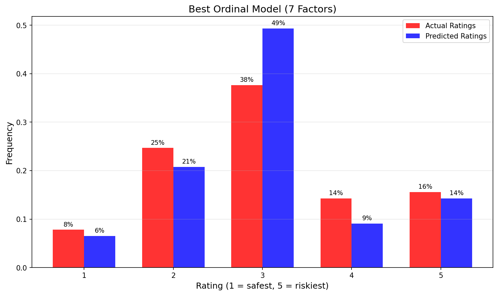
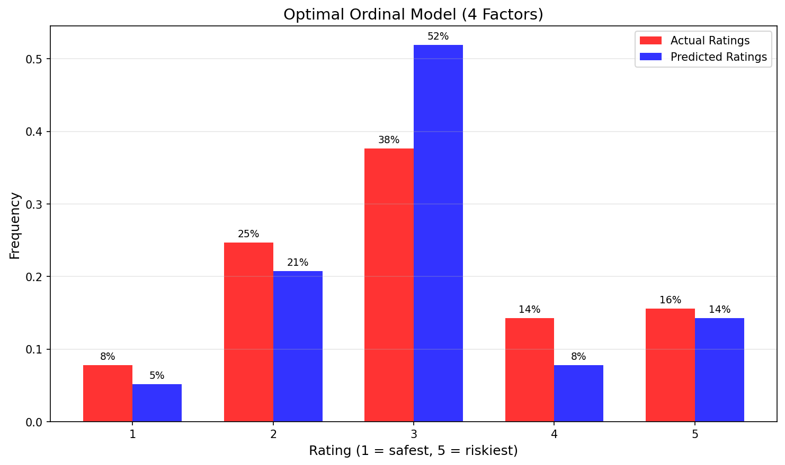

# Credit Risk Modeling for Specialized Lending

## Data Preparation

- Initial observations: 77
- Final observations (after cleaning): 77
- Default rate: 7.79%
- Risk factors: LTV_norm, DSU_BEN_norm, IRR_norm, DSCR_norm, LLCR_norm, IND_FACTOR_norm, REG_FACTOR_norm

## Expert Rating Distribution

| Rating | Count | Percentage |
|--------|-------|------------|
| 1 | 6 | 7.8% |
| 2 | 19 | 24.7% |
| 3 | 29 | 37.7% |
| 4 | 11 | 14.3% |
| 5 | 12 | 15.6% |

## Binary Logistic Regression Results

- Total models evaluated: 127
- Best Gini: 0.9061
- Best AUROC: 0.9531
- Best model factors: `LTV_norm, DSU_BEN_norm, IRR_norm, DSCR_norm, LLCR_norm, IND_FACTOR_norm, REG_FACTOR_norm`
- Note: The 7-factor model has highest Gini but all p-values > 0.05 (quasi-separation)

### Recommended Model (p < 0.10, VIF < 5)

- Factors: `DSU_BEN_norm, LLCR_norm, IND_FACTOR_norm, REG_FACTOR_norm`
- Number of factors: 4
- Gini: 0.8357
- AUROC: 0.9178
- AIC: 34.24
- Max VIF: 1.03
- All factors significant (p < 0.10), no multicollinearity

## Ordinal Logistic Regression Results

- Total models evaluated: 127
- Best Gini: 0.6832
- Best AUROC: 0.8416
- Best model factors: `LTV_norm, DSU_BEN_norm, IRR_norm, DSCR_norm, LLCR_norm, IND_FACTOR_norm, REG_FACTOR_norm`
- Exact match: 61.0%
- Within ±1 rating: 96.1%
- Within ±2 rating: 100.0%

### Recommended Ordinal Model (p < 0.10)

- Factors: `DSU_BEN_norm, IRR_norm, IND_FACTOR_norm, REG_FACTOR_norm`
- Number of factors: 4
- Gini: 0.6634
- AUROC: 0.8317
- Exact match: 61.0%
- Within ±1 rating: 94.8%
- All factors significant (p < 0.10)

## Actual vs Predicted Ratings

### Best Ordinal Model (7 Factors)

This model achieves maximum Gini but may overfit.

### Recommended Ordinal Model

This model uses 4 significant factors and is preferred for deployment.

### Comparison Table (Best Model)

| Rating | Actual | Predicted | Difference |
|--------|--------|-----------|------------|
| 1 | 7.8% | 6.5% | -1.3% |
| 2 | 24.7% | 20.8% | -3.9% |
| 3 | 37.7% | 49.4% | +11.7% |
| 4 | 14.3% | 9.1% | -5.2% |
| 5 | 15.6% | 14.3% | -1.3% |

## Key Findings

1. **Binary model** achieves strong predictive power (Gini > 0.9)
2. **Optimal binary model** uses 4 factors with VIF < 5 and all p-values < 0.10
3. **Ordinal model** correctly predicts exact rating for 61.0% of projects
4. **Within ±1 rating**, accuracy reaches 96.1%
5. **Main limitation**: Rating 3 is overpredicted (borderline cases hardest to classify)
6. **Recommended for deployment**: 4-factor binary model and 4-factor ordinal model

## Conclusions

Both models successfully predict credit risk using normalized risk factors.
The binary model is suitable for default screening, while the ordinal model
can support expert rating validation. The recommended models balance
predictive power with statistical significance and avoid multicollinearity.
